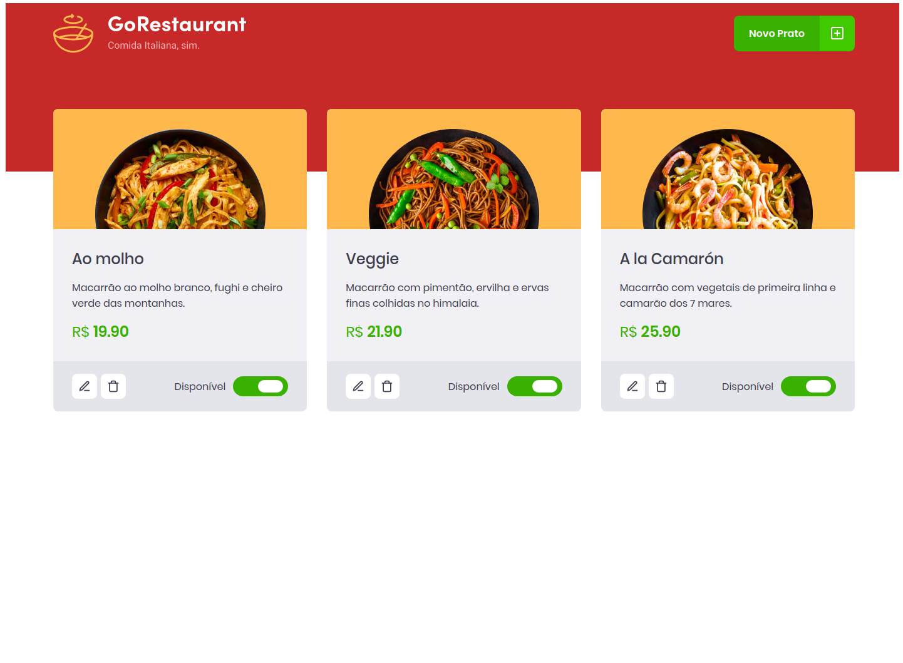

<h1 align="center">
  
</h1>

<p align="center">
  
</p>

<p align="center">
  <a href="#-tecnologias">Tecnologias</a>&nbsp;&nbsp;&nbsp;|&nbsp;&nbsp;&nbsp;
  <a href="#-projeto">Projeto</a>&nbsp;&nbsp;&nbsp;|&nbsp;&nbsp;&nbsp;
  <a href="#-como-usar?">Como usar?</a>&nbsp;&nbsp;&nbsp;&nbsp;&nbsp;&nbsp;
</p>

## 🛠 Tecnologias 🚀

Este projeto foi desenvolvido com as seguintes tecnologias:

- <a href="https://pt-br.reactjs.org/">React</a>
- <a href="https://www.typescriptlang.org/">Typescript</a>
- <a href="https://styled-components.com/">Styled-Components</a>
- <a href="https://github.com/typicode/json-server">Json-server</a>
- <a href="https://pt-br.reactjs.org/docs/hooks-intro.html">Hooks</a>
- <a href="https://react-icons.github.io/react-icons/">React-Icons</a>
- <a href="https://yarnpkg.com/">Yarn</a>

## 💻 Projeto

O GoRestaurant é uma aplicação cuja finalidade é a administração de refeições disponíveis para o cardápio de um restaurante.
A aplicação foi utilizada para o desafio complementar do chapter2 (módulo 2) do bootcamp Ignite da Rocketseat.
No ínicio do desafio a aplicação já se encontrava funcional, a tarefa era então refatorar a aplicação, transformando os class componentes em functional componentes, e convertendo a utilização de Javascript para Typescript.

## ⌨ Como usar?

Em primeiro lugar, clone o repositório:

```bash
# Clonando o repositório
git clone https://github.com/hitaloalvess/go-restaurant.git

# ✅ Em sequência:

# Instale as dependências:
yarn install

# Abra a pasta /final:
cd final

# Iniciando servidor
yarn server

# Iniciando projeto
yarn start
```

---
Made with ♥ by Hitalo 🚀